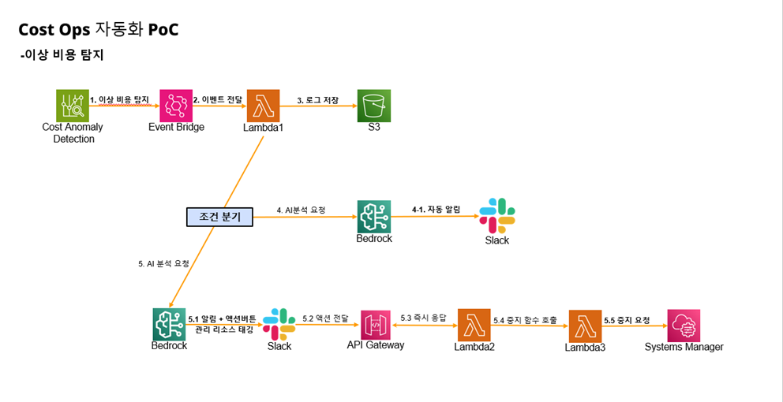
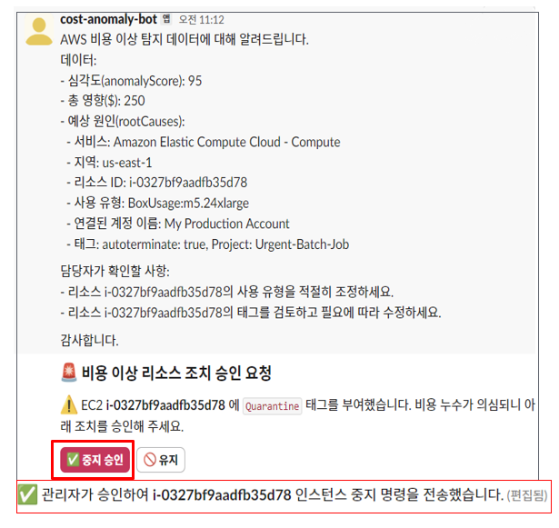

# CAD-Skyline (AWS Cost Anomaly Detection PoC)

## 📈 개요

이 프로젝트는 **AWS Cost Anomaly Detection** 서비스를 활용하여 **비용 이상 징후를 자동 감지**하고,  
이를 실시간으로 **Slack 알림** 및 **자동 완화 조치**로 연계하는 시스템입니다.

AWS의 비용 관리(FinOps) 기능과 여러 서비스를 조합하여,  
예상치 못한 비용 급등을 조기에 발견하고 대응할 수 있도록 설계되었습니다.

---

## 🙋 주요 구현 내용 (My Contribution)
* 본 프로젝트는 인턴십 팀 프로젝트 **Skyline**의 일부이며, 본인은 **비용 이상 탐지 파트**를 담당했습니다.  
* 비용 이상 탐지 파이프라인 전체 설계 및 개발  
* Router Lambda, Slack Bot, Bedrock 요약 통합  
* Slack Interactive Button → API Gateway → Worker Lambda 상호작용 처리  
* EC2 자동 중지를 위한 SSM Automation 연계 및 검증  

---

## 🎯 주요 목표

* AWS **비용 이상 이벤트** 자동 감지 및 모니터링  
* **Lambda**를 통한 이벤트 처리 및 알림 요약  
* **Amazon Bedrock** 활용 → 이상 내역 한국어 요약본 생성  
* **Slack Bot 알림** + 관리자 승인 버튼 제공  
* 승인 시 → EC2 인스턴스 **자동 중지 (SSM Automation)** 수행  

---

## 🏗 아키텍처

아래 아키텍처는 **비용 이상 탐지 → Slack 알림/승인 → 자동 완화**까지의 전체 흐름을 보여줍니다.

---

## ⚙️ 동작 흐름 (조건 분기 중심)

### 1. 이벤트 수신 및 로그 저장
* 모든 이상 탐지 이벤트는 **Router Lambda**에서 수신  
* 이벤트 원본은 항상 **S3에 저장** → 추후 분석/추적 가능  

### 2. 기본 요약 알림 (impact 조건)
* 이벤트의 `impact` 값이 **$1 이상**일 경우  
  * **Amazon Bedrock**으로 요약 생성  
  * Slack으로 **자연어 요약 알림 전송**  
* `$1 미만`일 경우  
  * 요약 알림은 생략 (**로그만 남음**)  

### 3. EC2 RootCause 분기
* 이벤트의 RootCause에 **EC2 리소스**가 포함된 경우:  
  1. 해당 인스턴스에 `autoterminate=true` 태그가 있는지 탐색  
  2. 조건이 맞으면:  
     * **Quarantine=true 태그를 자동 추가**  
     * Bedrock 요약 결과를 Slack 메시지 상단에 표시  
     * 이어서 **승인/유지 버튼** 포함된 블록 추가  
     * 최종적으로 **요약 + 버튼이 합쳐진 Slack 알림** 전송  
* RootCause가 EC2가 아니거나, 태그 조건이 맞지 않는 경우:  
  * **버튼 알림은 생성되지 않음**  
  * (단, impact ≥ $1이면 기본 요약 알림은 전송됨)  

### 4. Slack 상호작용
* 관리자가 Slack에서 버튼 선택:  
  * ✅ **중지 승인** → Worker Lambda → **SSM Automation 실행 (AWS-StopEC2Instance)**  
  * 🚫 **유지** → 아무 조치 없이 메시지 업데이트  

### 5. Slack 메시지 업데이트
* Worker Lambda가 처리 결과를 Slack 메시지에 반영:  
  * 승인 시: `"✅ 인스턴스 중지 명령 전송 완료"`  
  * 유지 시: `"ℹ️ 인스턴스 유지 결정"`  

---

## 🧩 주요 사용 서비스

* **AWS Cost Anomaly Detection** – 비용 이상 탐지  
* **Amazon EventBridge** – 이상 이벤트 라우팅  
* **AWS Lambda (Python)** – Router / Handler / Worker 함수  
* **Amazon S3** – 이상 로그 저장  
* **Amazon Bedrock (Titan)** – 이벤트 데이터 한국어 요약  
* **Slack Bot + API Gateway** – 알림 전송 및 승인 액션 처리  
* **AWS SSM Automation** – EC2 자동 중지 조치  

---

## 📊 결과

* 이상 징후 발생 시 → Slack 알림 및 요약 메시지 자동 전송  
* Slack에서 **승인 버튼** 클릭 시 → EC2 인스턴스 중지 자동화 확인  
* Slack 메시지 업데이트로 운영자가 결과 즉시 확인 가능  
* FinOps 환경에서 **비용 이상 탐지 + 대응 자동화 PoC**로 활용 가능  

---

## 📌 프로젝트 의의 및 향후 과제

### 의의
* AWS **비용 이상 탐지 이벤트**를 자동으로 수집하고, 로그로 축적하여 추후 분석 가능  
* **Slack 알림**을 통해 운영자가 실시간으로 비용 이상을 인지할 수 있도록 지원  
* 운영자의 최종 승인을 거쳐 **불필요한 비용을 줄이는 자동화된 대응 구조** 구현  

### PoC 한계점 (의도적 단순화)
* **PoC 성격**의 프로젝트이므로 빠른 검증을 위해 `$1` 임팩트 기준으로 알림 조건을 단순화  
* 자동화 조치 시나리오는 **EC2 인스턴스 중지**에만 국한하여 구현  

### 향후 과제
* Bedrock 요약 모델을 **FinOps 도메인 특화 데이터**로 추가 학습/튜닝하여 알림 품질 개선  
* 현재는 **EC2 리소스 중지**만 다루고 있으므로,  
  추후에는 RDS, EKS, Lambda, DynamoDB 등 **다양한 비용 발생 리소스까지 확장**하는 구조 필요  
* `autoterminate=true` 태그를 수동으로 설정하는 대신,  
  **거버넌스/상위 정책과 연계하여 자동 태깅**할 수 있는 체계로 확장  
  → 예: 리소스 생성 시점에 정책 기반으로 “중지해도 무방한 리소스” 자동 식별 및 태깅  
* 승인 프로세스를 Slack 외 다른 **협업 툴(Jira, Teams 등)**과 연동하여 활용성 강화 가능  

---

## 🔗 참고

* 본 프로젝트는 인턴십 팀 프로젝트 **Skyline**의 일부이며,  
  본 레포는 본인이 담당한 **비용 이상 탐지 파트**를 중심으로 정리한 것입니다.  

---
